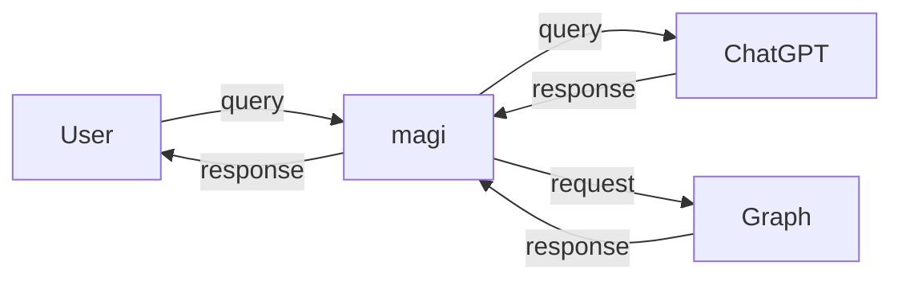

[](https://github.com/microsoft/hack-together)

# `magi`


> DALL-E prompt: A wizard watching over the rising sun atop a tower overlooking mountains and valleys but the wizard is a CLI tool for answering user queries using Microsoft Graph API, artistic, classical landscape painting

**`magi` is a smart AI which answers all of your queries using the Microsoft Graph API.**

## Examples

### List all users in the company

```bash
$ ./magi "Show all users in the company" | head -n 10
{
  "@odata.context": "https://graph.microsoft.com/v1.0/$metadata#users",
  "value": [
    {
      "businessPhones": [
        "\u002B1 425 555 0109"
      ],
      "displayName": "Adele Vance",
      "givenName": "Adele",
      "jobTitle": "Retail Manager",
```

### View unread emails of a user

```bash
$ ./magi "Show unread emails of PradeepG@5ybb1m.onmicrosoft.com" | head -n 10
{
  "@odata.context": "https://graph.microsoft.com/v1.0/$metadata#users(\u0027PradeepG%405ybb1m.onmicrosoft.com\u0027)/messages(subject,body,sender,sentDateTime,webLink)",
  "value": [
    {
      "@odata.type": "#microsoft.graph.eventMessageRequest",
      "@odata.etag": "W/\u0022CwAAABYAAADL8M9WgOrzQKgOydiWocLBAAAAAAc6\u0022",
      "id": "AAMkAGIwNzMzMjI4LTg5ZWYtNGUwYi1iYzBlLTE2NWY5NjdiYWIwMgBGAAAAAADqxEoU78ilTIGasXHLVnmYBwDL8M9WgOrzQKgOydiWocLBAAAAAAEMAADL8M9WgOrzQKgOydiWocLBAAAAAAFoAAA=",
      "sentDateTime": "2023-03-06T04:11:26Z",
      "subject": "Company All Hands",
      "webLink": "https://outlook.office365.com/owa/?ItemID=AAMkAGIwNzMzMjI4LTg5ZWYtNGUwYi1iYzBlLTE2NWY5NjdiYWIwMgBGAAAAAADqxEoU78ilTIGasXHLVnmYBwDL8M9WgOrzQKgOydiWocLBAAAAAAEMAADL8M9WgOrzQKgOydiWocLBAAAAAAFoAAA%3D\u0026exvsurl=1\u0026viewmodel=ReadMessageItem",

```

### View latest meetings of a user

```bash
$ ./magi "What were the last few meetings of PradeepG@5ybb1m.onmicrosoft.com?" | head -n 10
{
  "@odata.context": "https://graph.microsoft.com/v1.0/$metadata#users(\u0027PradeepG%405ybb1m.onmicrosoft.com\u0027)/calendar/events",
  "value": [
    {
      "@odata.etag": "W/\u0022y/DPVoDq80CoDsnYlqHCwQAAAAAHXg==\u0022",
      "id": "AAMkAGIwNzMzMjI4LTg5ZWYtNGUwYi1iYzBlLTE2NWY5NjdiYWIwMgBGAAAAAADqxEoU78ilTIGasXHLVnmYBwDL8M9WgOrzQKgOydiWocLBAAAAAAENAADL8M9WgOrzQKgOydiWocLBAAAAAHDnAAA=",
      "createdDateTime": "2023-03-06T04:11:29.0748984Z",
      "lastModifiedDateTime": "2023-03-06T04:13:31.5987848Z",
      "changeKey": "y/DPVoDq80CoDsnYlqHCwQAAAAAHXg==",
      "categories": [],
```

## Running Instructions

1. Build the project: `dotnet publish -c Release -o publish`
2. Go the created directory: `cd publish`
3. Create the configuration file: `config.json`
4. Invoke the power of `magi`: `./magi`

### Structure of `config.json`

```json
{
    "openApiKey": "YOUR-OPENAI-API-KEY",
    "clientId": "YOUR-AAD-APP-CLIENT-ID",
    "clientSecret": "YOUR-AAD-APP-CLIENT-SECRET",
    "tenantId": "YOUR-AAD-TENANT-ID"
}
```

## Design



### Libraries Used

- `System.CommandLine` for building the CLI functionality
- [OpenAI-API-dotnet](https://github.com/OkGoDoIt/OpenAI-API-dotnet) for interacting with the ChatGPT API
